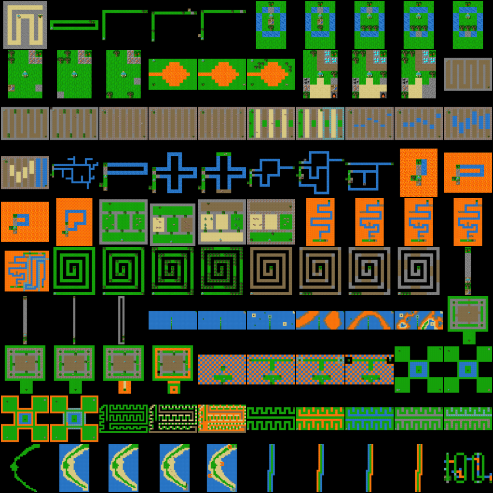

# Grafter Escape Rooms

Dataset and experiment details for Escape Rooms built using [GriddlyJS](griddly.ai).




## Installation

clone this repository and install the dependencies

```shell
pip install -r requirements.txt
```

Also install the module:

```shell
pip install -e .
```

## Human Trajectories

We provide recorded trajectories for each of the 100 levels [here](escape_rooms/trajectories/Grafter%20Escape%20Rooms.yaml).

### Example Usage

The trajectories dataset can be loaded and run using [run_trajectory.py](escape_rooms/utils/run_trajectory.py)

which looks like this:
```python
level = 37

env = EscapeRoomWrapper(level_generator_cls=HumanDataGenerator, player_observer_type="GlobalSprite2D")

# Get the trajectory from the dataset
current_dir = os.path.dirname(os.path.realpath(__file__))
with open(os.path.join(current_dir, "../trajectories/Grafter Escape Rooms.yaml"), 'r') as f:
    trajectories = yaml.load(f, yaml.SafeLoader)

    trajectory = trajectories[f"{level}"]
    env.seed(trajectory["seed"])
    env.reset(seed=level)
    for action in trajectory["steps"]:
        flat_action = get_flat_action(action)
        env.step(flat_action)

        env.render()
```

Simply set the `level` variable between 0 and 100 to load the trajectory for each level.


## Training

To train using the PCG generated dataset you can run the following command:

```shell
~/escape-rooms/ppo.py  --wandb-entity="my_wandb_name" --exp-name="griddly-escape-rooms" --track="true" --cuda="true" --total-timesteps="10000000" --num-envs="64" --num-steps="512" --learning-rate="0.005" --ent-coef="0.1" --seed="10" --checkpoint-path="checkpoints" --checkpoint-interval="30"
```

## Evaluation

To evaluate a trained set of checkpoints against the human designed escape rooms:

```shell
python eval.py --levels human --seed 48 --checkpoint-dir checkpoints/Grafter_30x30__Grafter-Mon-1e-4-256-4-False__Grafter-Mon__1__1654534045
```


## Using checkpoints in GriddlyJS

To use any of the model checkpoints trained in this repository and view them in GriddlyJS

### Convert checkpoint to keras

Firstly navigate to the directory where torch2keras.py script is located: 

```shell
cd escape_rooms/utils/tfjs/
```

Then call the script, pointing it to the required checkpoint and model output

```shell
python -m torch2keras \
--xp_path=../../../checkpoints/Grafter_30x30__Default__escape-rooms-final__0__1654619756 \
--model_tar=checkpoint_300 \
--output_name=tf_models/agent_model_keras
```

### Create tfjs model files

When the keras model is generated, it must be converted into a tensorflowjs module. This can be done by installing the [tensorflowjs_converter]() and runnig the following commands:

```shell
tensorflowjs_converter \
--input_format=tf_saved_model \
--saved_model_tags=serve \
--skip_op_check \
tf_models/agent_model_keras \
.
```

### Run GriddlyJS locally to load the model

If you haven't cloned the Griddly repository already, you can find it [here](https://github.com/Bam4d/Griddly)
place the generated `group1-shart1of1.bin` and `model.json` into the `public/models/Grafter Escape Rooms/` directory.

Then follow the instructions [here](https://github.com/Bam4d/Griddly/tree/master/js/README.md) on how to run GriddlyJS locally

